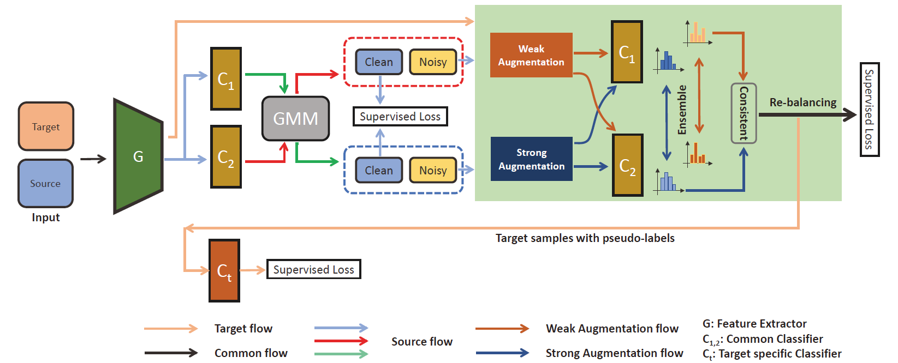

# PyTorch Code for [Robust Self-training with Label Refinement for Noisy Domain Adaptation]
## Zheng-Tao Cao, Shao-Yuan Li, Sheng-Jun Huang, Song-Can Chen

### Abstract:
Unsupervised Domain adaptation (UDA) intends to achieve excellent results by transferring knowledge from labeled source
domains to unlabeled target domains in which the data or label distribution changes. Previous UDA methods have acquired great
success when labels in source domain are pure. However, even the acquisition of a large scare clean labels in source domain needs
plenty of cost as well. In the presence of label noise in source domain, the traditional UDA methods will be seriously degraded as they
do not take appropriate measures against the label noise. In this paper, we propose an approach named Robust Self-training with Label
Refinement (RSLR) to address the above issue. RSLR adopts the self-training framework by maintaining a Labeling Network (LNet) on
the source domain, which is used to provide confident pseudo-labels to target samples, and a Target-specific Network (TNet) trained by
the pseudo-labeled samples. To combat the effect of label noise, LNet progressively distinguishes and refines the mislabeled source
samples. In combination with class re-balancing to combat the label distribution shift issue, RSLR leads to significant improvements
over the state-of-the-art methods on extensive benchmark datasets.

## Example Run
After creating a virtual environment, run 'pip install -r requirement.txt'
Example run (Digits tasks with 20% symmetric noise)

            python mnist_sydn.py

Example run (Office-31 tasks with 40% symmetric noise)

            python core/office.py --Log ${'yes'} --Noise ${'sym'} --warmup ${'3'} --Epoch ${'33'} --lr ${'0.01'} --phase ${'noise'} --p_threshold ${'0.6'} \
                --dset ${'office_d_a'} --RecordFolder ${'office31/D_A/pseudo_labels'} --noise_ratio ${ratio}
## Datasets
For datasets other than Office-31, Office-Home and Digits, you need to download them from their corresponsing website.

